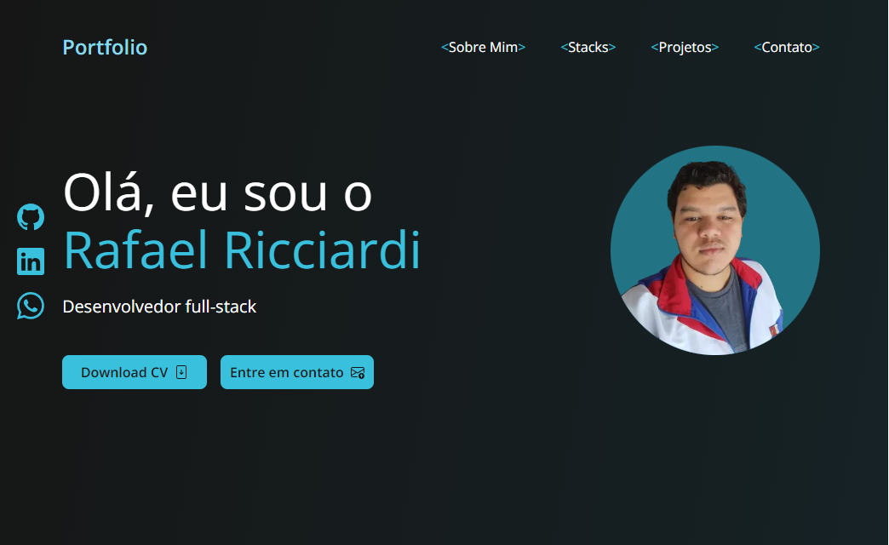

<h1 align="center">
    Portfolio - <a href="https://rafaelricciardi.vercel.app" target="_blank">Rafael Ricciardi</a>
</h1>

 

    
    

 

 

<h2>
    📚 Seções
</h2>

Este projeto possui 5 seções:

- <b>Home</b>: Uma breve apresentação.
- <b>Sobre mim</b>: Conto um pouco sobre a minha carreira.
- <b>Stacks</b>: Apresento as tecnologias que utilizo e tenho conhecimento.
- <b>Projetos</b>: Lista de projetos finalizados e em andamento.
- <b>Contatos</b>: Formas de contato.

<h2>
    🦾 Tecnologias utilizadas
</h2>

Para desenvolver este site utilizei as seguintes tecnologias:

 - NextJS
 - TailwindCSS
 - Typescript
 - ReactJS

# Autor

<a href="https://github.com/ricciardi305">
    
     
    <b>Rafael Ricciardi</b>
</a>

> Feito com ❤️ por Rafael Ricciardi 👋🏽 Entre em contato!
